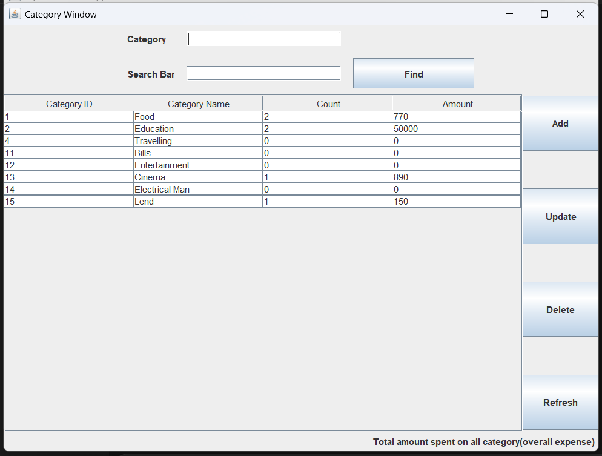
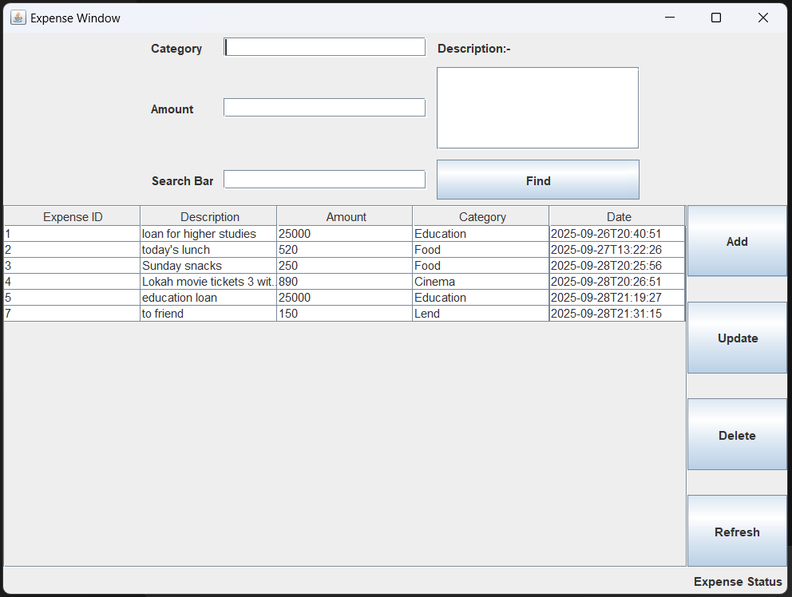

# Expense-Tracker

Tracking expenses through a Maven Java application.

This repository contains a desktop Java application (Maven-based) to record, view, and report expenses by category. Below are quick start instructions, usage notes, and the screenshots you provided showing the running application UI.

> Note: Add the two screenshot files you shared to the repository at:
> - assets/screenshots/category_window.png
> - assets/screenshots/expense_window.png
>
> Then the images below will appear correctly in GitHub.

---

## Table of contents
- [Features](#features)
- [Screenshots](#screenshots)
- [Tech stack](#tech-stack)
- [Prerequisites](#prerequisites)
- [Build & run](#build--run)
- [How to use the application (UI guide)](#how-to-use-the-application-ui-guide)
- [Data & configuration](#data--configuration)
- [Testing](#testing)
- [Troubleshooting](#troubleshooting)
- [Contributing](#contributing)
- [License](#license)
- [Contact](#contact)

## Features
- Add, update and delete expense categories.
- Add, update and delete expenses (amount, category, description, timestamp).
- Search and filter categories and expenses.
- Simple reporting: per-category total amounts and counts.
- Local persistence (file or embedded DB; see configuration section).

## Screenshots
(Category Window)


(Expense Window)


> If images do not display, make sure the files exist at `assets/screenshots/category_window.png` and `assets/screenshots/expense_window.png` and are committed to the repository.

## Tech stack
- Java (see `pom.xml` for the exact version)
- Maven for build and dependency management
- Swing (likely) for the desktop GUI (or similar Java UI toolkit)
- Local persistence (embedded DB or local file — see code)

## Prerequisites
- Java JDK installed (check `pom.xml` for required Java version)
- Maven installed
- Git (to clone repository)

Verify:
```bash
java -version
mvn -v
```

## Build & run

1. Clone the repository:
```bash
git clone https://github.com/Shan070106/Expense-Tracker.git
cd Expense-Tracker
```

2. Build with Maven:
```bash
mvn clean package
```
Maven will compile the project and produce a JAR under `target/`. The final artifact name depends on the `pom.xml` (for example `target/expense-tracker-1.0.0.jar`).

3. Run the application:
- If the build produced an executable jar:
```bash
java -jar target/<artifact-name>.jar
```
Replace `<artifact-name>.jar` with the actual JAR filename created in `target/`.

- Or run from your IDE:
  - Import as a Maven project (IntelliJ IDEA / Eclipse).
  - Locate the main class (search for `public static void main(String[] args)`).
  - Run using an application run configuration.

## How to use the application (UI guide)

Category Window (see screenshot):
- Fields:
  - Category: input for category name.
  - Search Bar: filter categories in the table.
- Table columns: Category ID, Category Name, Count, Amount.
- Buttons (right side):
  - Add — add a new category.
  - Update — update the selected category.
  - Delete — remove the selected category (if allowed).
  - Refresh — reload the table.
- Footer: shows total amount spent across categories (overall expense).

Expense Window (see screenshot):
- Fields:
  - Category: choose or type the category for the expense.
  - Amount: expense amount.
  - Description: optional long text describing the expense.
  - Search Bar: filter expense table.
- Table columns: Expense ID, Description, Amount, Category, Date.
- Buttons (right side):
  - Add — add a new expense record.
  - Update — update the selected expense.
  - Delete — delete the selected expense.
  - Refresh — reload the table.
- Footer: shows expense status or messages.

Typical flow:
1. Create categories (if none exist).
2. Add expenses and choose categories for each.
3. Use search and filters to find records.
4. Use Update/Delete to manage existing records.
5. Use Refresh to reload data from persistent storage.

## Data & configuration
- Check `src/main/resources` or configuration files in the project root for DB settings or file paths.
- The application likely uses an embedded DB or simple file storage — look for classes named `DB`, `Database`, `DAO`, `Repository`, or references to H2/SQLite/JDBC.
- Backup your data by copying the local DB file (if present) before making risky changes.

## Testing
- If there are unit tests, run:
```bash
mvn test
```
- Add tests to `src/test/java` when adding features or fixing bugs.

## Troubleshooting
- Build errors: run `mvn -X clean package` for verbose output.
- Missing main class: search for `public static void main` to find the entry point.
- UI not launching: ensure Java version matches `pom.xml` target.
- Database errors: ensure file permissions and configured paths are writable.

## Contributing
- Fork the repo, create a branch, implement changes, add tests, and open a pull request.
- Use clear commit messages and describe behavior in the PR.

Suggested workflow:
```bash
git checkout -b feat/your-feature
# make changes
git add .
git commit -m "Add <brief description>"
git push origin feat/your-feature
# open PR on GitHub
```

## Adding the screenshots you provided
Place the two PNG files you shared into the repo and commit them:
```bash
mkdir -p assets/screenshots
# copy your images into the directory:
# (e.g. from local paths)
cp /path/to/category_window.png assets/screenshots/category_window.png
cp /path/to/expense_window.png assets/screenshots/expense_window.png

git add assets/screenshots/category_window.png assets/screenshots/expense_window.png
git commit -m "Add UI screenshots"
git push
```

## License
If the project has no license file, it is "All rights reserved" by default. To open-source the project, add a `LICENSE` file (e.g., MIT, Apache-2.0) and update this section.

## Contact
Maintainer: Shan070106  
GitHub: https://github.com/Shan070106

---
